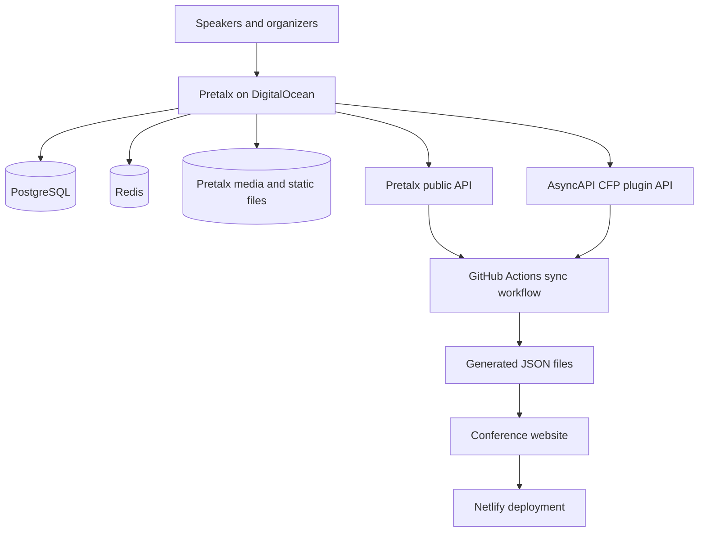

What starts as a workaround often becomes a turning point, especially when growth is involved. We have been running the AsyncAPI Conference brand for years (including the online editions), but we haven’t had a very stable system or process. We were content at the time until we reached a moment where it was no longer enough. We want sustainability, control, and a process that properly reflects how the brand should be run; hence, we steered towards this goal.


## The Back Story and Need

The idea of actually establishing our own CFP system has been there in the background for a while. Each time we planned a conference, there was a cycle that brought the same friction: limited flexibility and, mostly, a lack of consistency. The process involved multiple manual steps and frequent back-and-forth with organisers. Reviewer coordination was another pain point, with shared spreadsheets often falling out of sync, making it hard to track feedback or avoid overlap.  We found ourselves adjusting to these workflows as long as they just worked, but over time, it became clear that the issue wasn’t the way we did things; we didn’t actually have any ownership.

In fact, growth had forced our hand and prompted us to think sustainably, because as we grew and expanded our reach, so did the complexity of managing submissions. Relying on external support systems sometimes made it harder to plan ahead, manage shared information, and even create a better experience for our speakers. We needed something that scaled with us, hence we started exploring how other Open Source community conferences managed theirs and if there were any Open Source solutions out there.


## When Ideas Become Reality

We didn’t want to create another project that needed maintenance, but something that's already established, easy to set up, deploy and Open Source friendly. Based on research, we had three options, so we started [a GitHub discussion](https://github.com/asyncapi/conference-website/issues/949) to gain better insights from the community and determine whether others had more expertise with each platform.

In the end, we opted to use Pretalx as our conference management software and deploy it on DigitalOcean.


## The Architecture

The technical goal was to keep each system responsible for one job:

- Pretalx manages CFPs, speakers, reviews, accepted talks, schedules, and uploaded media.
- DigitalOcean runs the Pretalx production stack.
- GitHub Actions deploys Pretalx and syncs public conference data.
- The conference website renders venue pages, city lists, CFP states, speaker lists, and agenda sections from generated data.
- Netlify continues to serve the public conference website.



The important design decision is that the website is not the source of truth for CFP operations. Pretalx owns the event workflow. The website consumes a generated snapshot of the public data.

That gives us a static, predictable website build while still letting organisers work in a proper conference management system.

## Pretalx on DigitalOcean

We deployed Pretalx on a DigitalOcean Droplet using Docker Compose. The stack is intentionally small:

- `pretalx`: custom Pretalx image with the AsyncAPI CFP plugin installed.
- `db`: PostgreSQL 15.
- `redis`: Redis for sessions, cache, and Celery.
- `nginx`: internal container for `/media/...`, `/static/...`, and reverse proxying to Pretalx.
- `caddy`: host-level reverse proxy for HTTPS and public traffic.

The public request path looks like this:

```text
Browser
  -> https://cfp.asyncapi.com
  -> Caddy on the Droplet
  -> nginx container on 127.0.0.1:8346
  -> Pretalx container
```

We bind the Docker Compose HTTP port to `127.0.0.1`, so the container-level service is not directly exposed to the internet. Public traffic enters through Caddy on ports `80` and `443`, and the DigitalOcean Cloud Firewall only needs to allow the expected public ports.

The Compose service is roughly shaped like this:

```yaml:deploy/pretalx/docker-compose.yml
services:
  pretalx:
    build:
      context: .
      dockerfile: Dockerfile
      args:
        PRETALX_IMAGE_TAG: ${PRETALX_IMAGE_TAG:-v2026.1.2}
    image: asyncapi-pretalx:${PRETALX_IMAGE_TAG:-v2026.1.2}
    volumes:
      - ./conf/pretalx.cfg:/etc/pretalx/pretalx.cfg:ro
      - pretalx-data:/data
      - pretalx-public:/public

  nginx:
    image: nginx:1.27-alpine
    ports:
      - '127.0.0.1:${PRETALX_HTTP_PORT:-8346}:80'
    volumes:
      - ./nginx-container.conf:/etc/nginx/conf.d/default.conf:ro
      - pretalx-public:/public:ro

  db:
    image: postgres:15-alpine

  redis:
    image: redis:7-alpine
```

Only the Pretalx image tag is configurable. The supporting service images are pinned, so upgrades are deliberate rather than accidental.

## Why nginx and Caddy Both Exist

Caddy and nginx solve different problems.

Caddy is the public reverse proxy. It handles HTTPS, trusted certificates, and the public domain:

```caddy:/etc/caddy/Caddyfile
cfp.asyncapi.com {
	reverse_proxy 127.0.0.1:8346
}
```

nginx is inside the Compose stack. It serves uploaded media and static files from the shared `/public` volume, then proxies all application routes to Pretalx:

```nginx:deploy/pretalx/nginx-container.conf
map $http_x_forwarded_proto $pretalx_forwarded_proto {
    default $http_x_forwarded_proto;
    "" $scheme;
}

server {
    listen 80;
    client_max_body_size 3m;

    location /media/ {
        alias /public/media/;
    }

    location /static/ {
        alias /public/static/;
    }

    location / {
        proxy_pass http://pretalx:80;
        proxy_set_header Host $http_host;
        proxy_set_header X-Forwarded-For $proxy_add_x_forwarded_for;
        proxy_set_header X-Forwarded-Proto $pretalx_forwarded_proto;
    }
}
```

This split matters for image uploads. Pretalx can successfully upload and generate files, but if `/media/...` is not routed to the shared public volume, the browser will still see a `404` for speaker avatars or event images.

## Pretalx Configuration

Pretalx reads its runtime configuration from a generated config file. The deployment workflow renders this file from a template and keeps secrets in GitHub environment secrets.

The key filesystem and upload settings are:

```ini:deploy/pretalx/pretalx.cfg
[filesystem]
data = /data
logs = /data/logs
media = /public/media
static = /public/static

[files]
upload_limit = 2

[site]
url = https://cfp.asyncapi.com
```

The `url` value needs to be the public URL, not the internal container URL or a Droplet IP with a port. Pretalx uses this value when it builds absolute links. If it points to `localhost` or `:8346`, relative media URLs may work while absolute links break.

The upload limit is intentionally small. Speaker avatars and event images should be optimised before upload, and the Droplet should not spend storage or CPU resources on oversized media files.

## Custom Pretalx Plugin

Pretalx provides us with the CFP and schedule data, but the conference website also needs location metadata specific to our site. For example:

- city
- country
- venue address
- map URL
- event image URL

We added a small Pretalx plugin for that. Organisers can fill the fields in Pretalx, and the plugin exposes them through a public event endpoint:

```text
GET /api/events/{event}/p/asyncapi-cfp/event-info/
```

The response is website-friendly:

```json
{
  "city": "New York",
  "country": "United States",
  "address": "Conference venue address",
  "map_url": "https://maps.example.com/...",
  "image_url": "https://example.com/new-york.webp"
}
```

The `image_url` field lets city lists and venue pages display location-specific images without hardcoding them directly in website components.

## Conference Website Sync

The website does not fetch Pretalx on every page view. Instead, we sync public Pretalx data into the repository as generated JSON.

The workflow can be run manually or on a schedule:

```yaml:.github/workflows/sync-pretalx-schedule.yml
name: Sync Pretalx Schedule

on:
  workflow_dispatch:
  schedule:
    - cron: '0 7 * * 1'

jobs:
  sync:
    runs-on: ubuntu-latest
    steps:
      - uses: actions/checkout@v4
      - uses: actions/setup-node@v4
        with:
          node-version: '20'
          cache: npm
      - run: npm ci
      - run: npm run sync:pretalx
        env:
          PRETALX_SITE_URL: ${{ vars.PRETALX_SITE_URL }}
          PRETALX_API_TOKEN: ${{ secrets.PRETALX_API_TOKEN }}
```

The sync writes three files:

```text
config/pretalx/city-lists.json
config/pretalx/speakers.json
config/pretalx/agenda.json
```

Those files are then merged into the existing conference website data model. This keeps the website static and reviewable: every sync opens a pull request, and maintainers can inspect what changed before it reaches production.

The agenda behaviour also follows the Pretalx schedule state. If the schedule is released, the website can display agenda data even if the CFP deadline has not yet passed. If no schedule has been released, the website can continue to show the CFP flow for that location.

## Deployment Workflow

The deployment workflow is application deployment, not full infrastructure provisioning. The Droplet is prepared once, and GitHub Actions handles repeat deploys.

The deploy workflow does these steps:

1. Render `pretalx.cfg` from the template.
2. Upload the Compose file, nginx config, generated config, and plugin.
3. Write the remote `.env`.
4. Pull pinned base service images.
5. Build only the custom Pretalx image.
6. Start the Compose stack.
7. Run a public health check.

The remote environment file stays small:

```env:/opt/asyncapi-pretalx/.env
POSTGRES_PASSWORD=...
PRETALX_HTTP_PORT=8346
PRETALX_IMAGE_TAG=v2026.1.2
PRETALX_FILE_UPLOAD_LIMIT=2
GUNICORN_FORWARDED_ALLOW_IPS=127.0.0.1
```

The one-time Droplet setup includes:

- Create a `pretalx` deploy user
- Install Docker and the Compose plugin
- Create `/opt/asyncapi-pretalx`
- Point DNS to the Droplet
- Allow inbound `22`, `80`, and `443` in the DigitalOcean firewall
- Install Caddy
- Configure backups and periodic jobs

## Email Delivery

Pretalx sends account, submission, proposal, and schedule emails. Local development uses Mailpit, so emails are captured in a browser instead of being sent externally.

Production uses Mailjet:

```ini:pretalx.cfg
[mail]
from = cfp@asyncapi.com
host = in-v3.mailjet.com
port = 2525
user = <mailjet-api-key>
password = <mailjet-secret-key>
tls = True
ssl = False
```

The sender address and domain need to be verified in Mailjet. The domain also needs the SPF, DKIM, and DMARC records Mailjet provides. Without that DNS setup, email can be technically sent but still fail deliverability checks.

## Backups and Operations

There are two critical data areas:

- PostgreSQL database.
- Pretalx data and public media volumes.

Redis is not backed up because Pretalx uses it for temporary and cached data.

The backup job dumps PostgreSQL and archives the Docker volumes:

```sh:backup-pretalx.sh
docker compose --env-file .env exec -T db \
  pg_dump -U pretalx -d pretalx | gzip > "backups/postgres/pretalx-${stamp}.sql.gz"

docker run --rm \
  -v "${data_volume}:/data:ro" \
  -v "/opt/asyncapi-pretalx/backups/volumes:/backup" \
  alpine tar -czf "/backup/pretalx-data-${stamp}.tgz" -C /data .

docker run --rm \
  -v "${public_volume}:/public:ro" \
  -v "/opt/asyncapi-pretalx/backups/volumes:/backup" \
  alpine tar -czf "/backup/pretalx-public-${stamp}.tgz" -C /public .
```

The public volume is included because it contains uploaded speaker images, event images, generated thumbnails, and other media that users should not have to recreate manually.

We also run Pretalx periodic tasks from cron:

```cron
15,45 * * * * cd /opt/asyncapi-pretalx && docker compose --env-file .env exec -T pretalx pretalx runperiodic
0 8 * * * /opt/asyncapi-pretalx/bin/backup-pretalx.sh >> /opt/asyncapi-pretalx/backups/backup.log 2>&1
```

For production, backups should not live only on the Droplet. The local backup directory can be synced to DigitalOcean Spaces or another external object store.

## Testing the Setup

The most useful checks were operational:

```bash
curl -I https://cfp.asyncapi.com/healthcheck
curl -I https://cfp.asyncapi.com/static/pretalx-manifest.json
curl -I https://cfp.asyncapi.com/media/<uploaded-file>
```

For the plugin endpoint:

```bash
curl https://cfp.asyncapi.com/api/events/<event-slug>/p/asyncapi-cfp/event-info/
```

For the containers:

```bash
docker compose --env-file .env ps
docker compose --env-file .env logs --tail=100 pretalx
docker compose --env-file .env logs --tail=100 nginx
docker compose --env-file .env exec pretalx supervisorctl status
```

These checks caught issues that normal unit tests would not: incorrect public URLs, missing media routing, broken absolute image links, incorrect volume permissions, and health checks failing because redirects were not followed.

## What DigitalOcean Gives Us

DigitalOcean gives us a practical operating model for this system. Droplet, Firewall, DNS, persistent Docker volumes, and optional Spaces backups are enough for this workload while remaining easy for maintainers to understand.

The main benefit is ownership. We can tune the stack, manage upgrades, maintain backups, expose the right public endpoints, and connect Pretalx to the conference website without relying on manual exports or third-party event workflows.

As the AsyncAPI Conference continues to grow across locations, this gives us a more sustainable foundation: Pretalx for conference operations, DigitalOcean for hosting, GitHub Actions for deployment and sync, and the AsyncAPI website for the public experience.

## Lessons

The biggest lesson is that owning the process means owning the operational details too. Installing an Open Source tool is only the first part. Media routing, upload limits, email delivery, backups, TLS, health checks, and sync workflows decide whether the system is usable in practice.

The second lesson is that the website should not become the source of truth for conference operations. Pretalx should own the event workflow, and the website should consume clean, generated data.

Finally, small infrastructure can still be production-grade if the boundaries are clear. The setup works because the stack is explicit, documented, backed up, and integrated with the rest of our workflow via GitHub Actions.